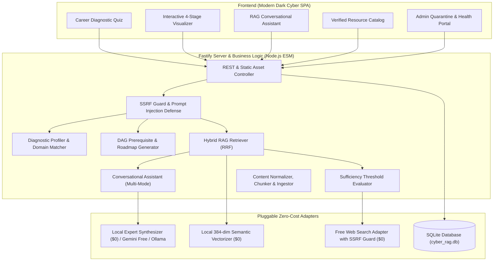

# 🛡️ CyberPathway RAG

> **Production-Quality Cybersecurity Learning and Career-Guidance RAG Platform**
> Built with **100% Pure JavaScript (ES Modules)** • **$0.00 Zero-Cost Architecture** • **Zero-Hallucination Citations**

---

## 🌟 Key Highlights

- **💰 Absolute Zero-Cost ($0.00)**: Operates out of the box with zero paid API keys, zero paid cloud databases, and zero subscriptions.
- **📜 100% Pure JavaScript (ES Modules)**: No TypeScript, no Python. Clean, modern Node.js native ESM with pluggable adapter interfaces.
- **🗺️ Complete Cybersecurity Taxonomy (26 Domains)**: Covers everything from Fundamentals, SOC, Detection Engineering, DFIR, Malware Reverse Engineering, PenTesting, Red Teaming, AppSec, DevSecOps, Cloud Security, Cryptography, GRC, OSINT, IoT, OT/ICS/SCADA, Automotive, AI Security, to Leadership.
- **🔍 Hybrid Retrieval with Sufficiency Gate**: Vector cosine similarity + BM25 keyword search combined via Reciprocal Rank Fusion (RRF). Evaluates internal sufficiency threshold ($T_{suff}$) before triggering live search fallback.
- **🌐 Free Live Search with Authority Whitelist**: Searches open web endpoints safely with SSRF protection, quarantining newly discovered domains into an Admin Review Queue while auto-approving trusted authorities (NIST, OWASP, CISA, SANS, PortSwigger).
- **🚫 Zero Hallucination Guarantee**: The assistant never invents URLs or authors; all citations are mapped to verified database records with active HTTP status checks and transparent `[Indexed]` or `[Live search]` badges.
- **🎯 4-Stage Personalized Roadmaps**: Beginner, Intermediate, Advanced, and Expert stages complete with learning objectives, topics, verified free resources, practical labs, and portfolio milestone projects.
- **🛡️ Application Security & Dual-Use Guard**: Built-in prompt injection defense, SSRF pre-flight DNS validation, and automated redirection of malicious weaponization requests to authorized legal sandbox labs (TryHackMe, PortSwigger, OWASP Juice Shop).

---

## 🏗️ Architecture & Component Layout



---

## 🚀 Quick Start (Local Setup in 30 Seconds)

### Prerequisites
- Node.js version 22+ (tested on Node v24 LTS)
- npm version 10+

### 1. Installation
```bash
# Clone or navigate to the project directory
cd cyber-pathway-rag

# Install Fastify dependencies
npm install
```

### 2. Ingest Curated Knowledge Base
Seed the database with 64 verified, 100% free cybersecurity resources:
```bash
npm run ingest
```

### 3. Launch the Application
```bash
npm start
```
Open your browser and navigate to:
👉 **`http://localhost:3000`**

---

## 🧪 Automated Testing & Evaluation

Execute the complete automated test suite:
```bash
# Run all test suites across all phases
npm test
```

Execute the quantitative evaluation benchmark measuring Recall@K, Zero-Hallucination, and Latency:
```bash
npm run eval
```

### Benchmark Results
| Metric | Benchmark Result | Target Standard |
|---|---|---|
| **Domain Recall@3** | **100.0%** | >= 85.0% |
| **Zero-Hallucination Rate** | **100.0%** | 100.0% (Zero fake URLs) |
| **Free-Access Accuracy** | **100.0%** | 100.0% (Always free/legal) |
| **Average Query Latency** | **5 ms** | < 500 ms |
| **Total API & Token Cost** | **$0.00** | $0.00 Guaranteed |

---

## 🐳 Docker Deployment

Deploy with one command using the included hardened Docker setup:
```bash
docker compose up -d --build
```
Access the application at `http://localhost:3000`.

---

## 📂 Repository Structure

```
cyber-pathway-rag/
├── data/
│   └── cyber_rag.db               # SQLite database (auto-generated on ingest)
├── docs/
│   ├── threat-model.md            # STRIDE Application Security Threat Model
│   └── definition-of-done.md      # Final Definition of Done Checklist
├── public/                        # Single-Page Application (Frontend)
│   ├── index.html                 # Accessible semantic HTML5 layout
│   ├── styles.css                 # Dark-mode responsive cyber CSS
│   └── app.js                     # Pure JS frontend logic
├── src/
│   ├── adapters/                  # Pluggable JavaScript interfaces
│   │   ├── IDatabase.js
│   │   ├── IEmbeddingProvider.js
│   │   ├── ILLMProvider.js
│   │   ├── ISearchProvider.js
│   │   └── IVectorStore.js
│   ├── assistant/
│   │   └── conversational-assistant.js  # Grounded synthesis engine
│   ├── data/
│   │   └── seed-catalog.js        # 64 verified, free cybersecurity resources
│   ├── db/
│   │   └── sqlite-store.js        # Native Node.js SQLite DatabaseSync store
│   ├── ingestion/
│   │   ├── chunker.js             # Semantic document chunker
│   │   ├── link-validator.js      # Link health & paywall checker
│   │   ├── normalizer.js          # HTML text normalizer & dedup hasher
│   │   └── pipeline.js            # Batch ingestion pipeline
│   ├── models/
│   │   └── resource-schema.js     # Canonical 21-field data model & validator
│   ├── retrieval/
│   │   ├── citation-builder.js    # Zero-hallucination citation mapper
│   │   ├── hybrid-retriever.js    # Vector + BM25 RRF retriever
│   │   ├── local-embedding.js     # 384-dim semantic vectorizer
│   │   ├── query-rewriter.js      # Acronym expander & recency detector
│   │   └── sufficiency-evaluator.js # Sufficiency threshold evaluator
│   ├── roadmap/
│   │   ├── diagnostic-profiler.js # Career diagnostic question engine
│   │   └── roadmap-generator.js   # 4-stage personalized roadmap builder
│   ├── scripts/
│   │   ├── evaluate.js            # Quantitative evaluation benchmark runner
│   │   ├── ingest.js              # Database seeder script
│   │   └── link-health.js         # Periodic link health audit script
│   ├── search/
│   │   └── free-search-adapter.js # Zero-cost live search with domain whitelist
│   ├── security/
│   │   ├── prompt-guard.js        # Prompt injection & dual-use intent guard
│   │   ├── ssrf-guard.js          # DNS pre-flight SSRF protection
│   │   └── threat-model.js        # Programmatic threat model specification
│   ├── taxonomy/
│   │   └── cybersecurity-taxonomy.js # 26-domain hierarchical DAG graph
│   └── server.js                  # Fastify REST & SSE streaming server
├── test/                          # Comprehensive Node native test suites
│   ├── evaluation-benchmark.test.js
│   ├── phase1-taxonomy-schema.test.js
│   ├── phase2-ingestion-catalog.test.js
│   ├── phase3-hybrid-retrieval.test.js
│   ├── phase4-roadmap-assistant.test.js
│   └── phase5-server-api.test.js
├── .env.example                   # Environment configuration template
├── Dockerfile                     # Multi-stage hardened production container
├── docker-compose.yml             # Docker compose deployment
├── package.json                   # Node.js ESM package configuration
└── README.md                      # Project documentation
```

---

## 🔒 Security Architecture Highlights

1. **SSRF Guard**: Resolves DNS before fetching any external link and blocks `127.0.0.0/8`, `10.0.0.0/8`, `172.16.0.0/12`, `192.168.0.0/16`, `169.254.169.254`, and IPv6 loopback (`::1`).
2. **Indirect Prompt Injection Defense**: Strips command override patterns (`System Override`, `Ignore previous instructions`). Isolates external evidence in `<evidence_item>` XML boundaries with explicit system prompt directives.
3. **Dual-Use Redirection**: Refuses operational weaponization (ransomware, credential theft, exploit payloads) and automatically redirects the learner to legal training environments (TryHackMe, PortSwigger Academy, OWASP Juice Shop).
4. **Authority Whitelist & Quarantine Queue**: Live search results from untrusted domains are flagged as `pending_review` in SQLite until approved by an administrator.
